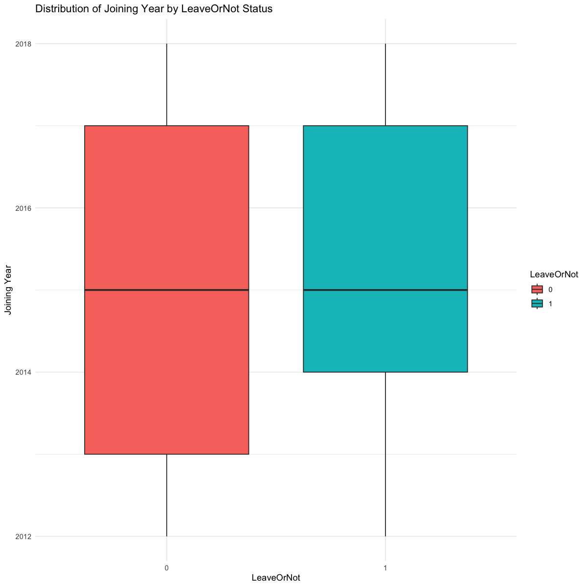

# STAT 301 Individual Assignment #1

## Data Description & Exploratory Data Analysis and Visualization


```R
library(tidyverse)
library(ggplot2)
library(mosaic)
library(moderndive)
library(caTools)
library(leaps)
library(repr)
library(digest)
library(infer)
library(gridExtra)
library(broom)
library(GGally)
library(AER)
library(reshape2)
```


```R
# Load the dataset
employee <- read_csv("employee.csv") %>% mutate_if(is.numeric, round, 2)
head(employee)
```

    Rows: 4653 Columns: 9
    ── Column specification ──────────────────────────────────────────────────────────────────
    Delimiter: ","
    chr (4): Education, City, Gender, EverBenched
    dbl (5): JoiningYear, PaymentTier, Age, ExperienceInCurrentDomain, LeaveOrNot
    
    ℹ Use `spec()` to retrieve the full column specification for this data.
    ℹ Specify the column types or set `show_col_types = FALSE` to quiet this message.


<table class="dataframe">
<caption>A tibble: 6 × 9</caption>
<thead>
	<tr><th scope=col>Education</th><th scope=col>JoiningYear</th><th scope=col>City</th><th scope=col>PaymentTier</th><th scope=col>Age</th><th scope=col>Gender</th><th scope=col>EverBenched</th><th scope=col>ExperienceInCurrentDomain</th><th scope=col>LeaveOrNot</th></tr>
	<tr><th scope=col>&lt;chr&gt;</th><th scope=col>&lt;dbl&gt;</th><th scope=col>&lt;chr&gt;</th><th scope=col>&lt;dbl&gt;</th><th scope=col>&lt;dbl&gt;</th><th scope=col>&lt;chr&gt;</th><th scope=col>&lt;chr&gt;</th><th scope=col>&lt;dbl&gt;</th><th scope=col>&lt;dbl&gt;</th></tr>
</thead>
<tbody>
	<tr><td>Bachelors</td><td>2017</td><td>Bangalore</td><td>3</td><td>34</td><td>Male  </td><td>No </td><td>0</td><td>0</td></tr>
	<tr><td>Bachelors</td><td>2013</td><td>Pune     </td><td>1</td><td>28</td><td>Female</td><td>No </td><td>3</td><td>1</td></tr>
	<tr><td>Bachelors</td><td>2014</td><td>New Delhi</td><td>3</td><td>38</td><td>Female</td><td>No </td><td>2</td><td>0</td></tr>
	<tr><td>Masters  </td><td>2016</td><td>Bangalore</td><td>3</td><td>27</td><td>Male  </td><td>No </td><td>5</td><td>1</td></tr>
	<tr><td>Masters  </td><td>2017</td><td>Pune     </td><td>3</td><td>24</td><td>Male  </td><td>Yes</td><td>2</td><td>1</td></tr>
	<tr><td>Bachelors</td><td>2016</td><td>Bangalore</td><td>3</td><td>22</td><td>Male  </td><td>No </td><td>0</td><td>0</td></tr>
</tbody>
</table>


```R
# Check data summary
employee_summary <- summary(employee)
head(employee_summary)
```


      Education          JoiningYear       City            PaymentTier   
     Length:4653        Min.   :2012   Length:4653        Min.   :1.000  
     Class :character   1st Qu.:2013   Class :character   1st Qu.:3.000  
     Mode  :character   Median :2015   Mode  :character   Median :3.000  
                        Mean   :2015                      Mean   :2.698  
                        3rd Qu.:2017                      3rd Qu.:3.000  
                        Max.   :2018                      Max.   :3.000  
          Age           Gender          EverBenched       
     Min.   :22.00   Length:4653        Length:4653       
     1st Qu.:26.00   Class :character   Class :character  
     Median :28.00   Mode  :character   Mode  :character  
     Mean   :29.39                                        
     3rd Qu.:32.00                                        
     Max.   :41.00                                        
     ExperienceInCurrentDomain   LeaveOrNot    
     Min.   :0.000             Min.   :0.0000  
     1st Qu.:2.000             1st Qu.:0.0000  
     Median :3.000             Median :0.0000  
     Mean   :2.906             Mean   :0.3439  
     3rd Qu.:4.000             3rd Qu.:1.0000  
     Max.   :7.000             Max.   :1.0000  


## Data description

The `employee` dataset (obtained from Kaggle) consists of information on 4,653 employees and includes the following nine variables:

- `Education`: Categorical variable representing the highest level of education attained by the employee ("Bachelors" "Masters", "PhD").
- `JoiningYear`: Numerical variable representing the year the employee joined the company.
- `City`: Categorical variable representing the city where the employee is located ("New Delhi", "Bangalore" "Pune").
- `PaymentTier`: Categorical variable representing the different salary tiers (1, 2, 3).
- `Age`: Numerical variable representing the age of the employee.
- `Gender`: Categorical variable representing the gender of the employee ("Male", "Female").
- `EverBenched`: Categorical (binary) variable representing whether the employee has ever been "benched" ("Yes") or not ("No").
- `ExperienceInCurrentDomain`: Numerical variable representing years of experience the employee has.
- `LeaveOrNot`: Binary response variable representing whether the employee left the company (1) or stayed (0).

Link to dataset - https://www.kaggle.com/datasets/tawfikelmetwally/employee-dataset/data

## Question

Using the `employee` dataset, **we are looking to infer which factors contribute to an employee leaving, and if we can predict whether an employee will leave based on their demographics, job experience, and performance?**

The dataset contains detailed information on both employee characteristics and their employment history, which allows for examining patterns and relationships between these input variables and the response variable.

- Response Variable (Y): `LeaveOrNot` — This binary variable indicates whether an employee has left the company (1) or remained (0).
- Explanatory Variables (X): Variables such as `Age`, `Gender`, `Education`, `JoiningYear`, `City`, `PaymentTier`, `EverBenched`, and `ExperienceInCurrentDomain` will be used to understand potential factors affecting whether an employee leaves or not.

## Exploratory Data Analysis and Visualization


```R
# Convert categorical variables to factors
employee <- employee %>%
  mutate(
    Education = as.factor(Education),
    City = as.factor(City),
    PaymentTier = as.factor(PaymentTier),
    Gender = as.factor(Gender),
    EverBenched = as.factor(EverBenched),
    LeaveOrNot = as.factor(LeaveOrNot)
  )

head(employee)

# Check for missing values
sum(is.na(employee))
```


<table class="dataframe">
<caption>A tibble: 6 × 9</caption>
<thead>
	<tr><th scope=col>Education</th><th scope=col>JoiningYear</th><th scope=col>City</th><th scope=col>PaymentTier</th><th scope=col>Age</th><th scope=col>Gender</th><th scope=col>EverBenched</th><th scope=col>ExperienceInCurrentDomain</th><th scope=col>LeaveOrNot</th></tr>
	<tr><th scope=col>&lt;fct&gt;</th><th scope=col>&lt;dbl&gt;</th><th scope=col>&lt;fct&gt;</th><th scope=col>&lt;fct&gt;</th><th scope=col>&lt;dbl&gt;</th><th scope=col>&lt;fct&gt;</th><th scope=col>&lt;fct&gt;</th><th scope=col>&lt;dbl&gt;</th><th scope=col>&lt;fct&gt;</th></tr>
</thead>
<tbody>
	<tr><td>Bachelors</td><td>2017</td><td>Bangalore</td><td>3</td><td>34</td><td>Male  </td><td>No </td><td>0</td><td>0</td></tr>
	<tr><td>Bachelors</td><td>2013</td><td>Pune     </td><td>1</td><td>28</td><td>Female</td><td>No </td><td>3</td><td>1</td></tr>
	<tr><td>Bachelors</td><td>2014</td><td>New Delhi</td><td>3</td><td>38</td><td>Female</td><td>No </td><td>2</td><td>0</td></tr>
	<tr><td>Masters  </td><td>2016</td><td>Bangalore</td><td>3</td><td>27</td><td>Male  </td><td>No </td><td>5</td><td>1</td></tr>
	<tr><td>Masters  </td><td>2017</td><td>Pune     </td><td>3</td><td>24</td><td>Male  </td><td>Yes</td><td>2</td><td>1</td></tr>
	<tr><td>Bachelors</td><td>2016</td><td>Bangalore</td><td>3</td><td>22</td><td>Male  </td><td>No </td><td>0</td><td>0</td></tr>
</tbody>
</table>


0


```R
employee_education_plot <- ggplot(employee, aes(x = Education, fill = LeaveOrNot)) +
                              geom_bar(position = "fill") +
                              labs(title = "Proportion of Employees Leaving by Education Level",
                                   x = "Education Level", y = "Proportion", fill = "LeaveOrNot") +
                              theme_minimal()
employee_education_plot
```


    

    


This stacked bar plot illustrates the proportion of employees who stayed (indicated by "0") and those who left (indicated by "1") within each `Education` level. This plot suggests that employees with Bachelors and Masters are associated with a higher likelihood of leaving compared to employees with PhDs, indicating that `Education` may be a strong predictor of `LeaveOrNot`.


```R
employee_age_plot <- ggplot(employee, aes(x = LeaveOrNot, y = Age, fill = LeaveOrNot)) +
                          geom_boxplot() +
                          labs(title = "Distribution of Age by LeaveOrNot Status",
                               x = "LeaveOrNot", y = "Age", fill = "LeaveOrNot") +
                          theme_minimal()
employee_age_plot
```


    

    


This box plot illustrates the distribution of `Age` for people who stayed (indicated by "0") and those who left (indicated by "1"). This plot suggests that the median ages and distributions are similar between employees who stayed and those who left, indicating that `Age` may not be a strong predictor of `LeaveOrNot`. 


```R
employee_gender_plot <- ggplot(employee, aes(x = Gender, fill = LeaveOrNot)) +
                          geom_bar(position = "fill") +
                          labs(title = "Proportion of Employees Leaving by Gender",
                               x = "Gender", y = "Proportion", fill = "LeaveOrNot") +
                          theme_minimal()
employee_gender_plot
```


    

    


This stacked bar plot illustrates the proportion of employees who stayed (indicated by "0") and those who left (indicated by "1") for each `Gender`. This plot suggests that female employees are associated with a higher likelihood of leaving compared to male employees, indicating that `Gender` may be a strong predictor of `LeaveOrNot`.


```R
employee_joining_year_plot <- ggplot(employee, aes(x = LeaveOrNot, y = JoiningYear, fill = LeaveOrNot)) +
                                  geom_boxplot() +
                                  labs(title = "Distribution of Joining Year by LeaveOrNot Status",
                                       x = "LeaveOrNot", y = "Joining Year", fill = "LeaveOrNot") +
                                  theme_minimal()
employee_joining_year_plot
```


    

    


This box plot illustrates the distribution of `JoiningYear` for people who stayed (indicated by "0") and those who left (indicated by "1"). This plot suggests that the median joining years and distributions are similar between employees who stayed and those who left, indicating that `JoiningYear` may not be a strong predictor of `LeaveOrNot`. 


```R
employee_payment_tier_plot <- ggplot(employee, aes(x = PaymentTier, fill = LeaveOrNot)) +
                                  geom_bar(position = "fill") +
                                  labs(title = "Proportion of Employees Leaving by Payment Tier",
                                       x = "Payment Tier", y = "Proportion", fill = "LeaveOrNot") +
                                  theme_minimal()
employee_payment_tier_plot
```


    

    


This stacked bar plot illustrates the proportion of employees who stayed (indicated by "0") and those who left (indicated by "1") for each `PaymentTier`. This plot suggests that employees with the highest payment tier are the least likely to leave, and that lower payment tiers are associated with a higher likelihood of leaving. This indicates that `PaymentTier` may be a strong predictor of `LeaveOrNot`.


```R
employee_city_plot <- ggplot(employee, aes(x = City, fill = LeaveOrNot)) +
                          geom_bar(position = "fill") +
                          labs(title = "Proportion of Employees Leaving by City",
                               x = "City", y = "Proportion", fill = "LeaveOrNot") +
                          theme_minimal()
employee_city_plot
```


    

    


This stacked bar plot illustrates the proportion of employees who stayed (indicated by "0") and those who left (indicated by "1") for each `City`. This plot suggests that employees living in Bangalore and Delhi are less likely to leave in comparison to employees living in Pune. This indicates that `City` may be a strong predictor of `LeaveOrNot`.


```R
employee_benched_plot <- ggplot(employee, aes(x = EverBenched, fill = LeaveOrNot)) +
                              geom_bar(position = "fill") +
                              labs(title = "Proportion of Employees Leaving by Benching Status",
                                   x = "EverBenched", y = "Proportion", fill = "LeaveOrNot") +
                              theme_minimal()
employee_benched_plot
```


    

    


This stacked bar plot illustrates the proportion of employees who stayed (indicated by "0") and those who left (indicated by "1") for both levels of `EverBenched`. This plot suggests that employees that have been benched are slightly more likely to leave, indicating that `EverBenched` may be a strong predictor of `LeaveOrNot`.


```R
employee_experience_plot <- ggplot(employee, aes(x = LeaveOrNot, y = ExperienceInCurrentDomain, fill = LeaveOrNot)) +
                              geom_boxplot() +
                              labs(title = "Distribution of Experience in Current Domain by LeaveOrNot Status",
                                   x = "LeaveOrNot", y = "Experience in Current Domain", fill = "LeaveOrNot") +
                              theme_minimal()
employee_experience_plot
```


    

    


This box plot illustrates the distribution of `ExperienceInCurrentDomain` for people who stayed (indicated by "0") and those who left (indicated by "1"). This plot suggests that the median years and distributions are similar between employees who stayed and those who left, indicating that `ExperienceInCurrentDomain` may not be a strong predictor of `LeaveOrNot`. However, this should be investigated further.

## Conclusion

Therefore, after exploring all eight input variables, we can summarise that `Education`, `Gender`, `PaymentTier`, `City`, `EverBenched`
are likely to be strong predictors of `LeaveOrNot`, while `Age`, `JoiningYear`, `ExperienceInCurrentDomain` appear to be less relevant as standalone predictors. However, this is only an initial exploration of the data, and the interactions between variables have not yet been examined.

Hence, to gain a deeper understanding, more complex interactions between the variables need to be studied to determine their combined effect on the response. This further analysis could reveal underlying relationships and provide a more accurate prediction model for the response.
